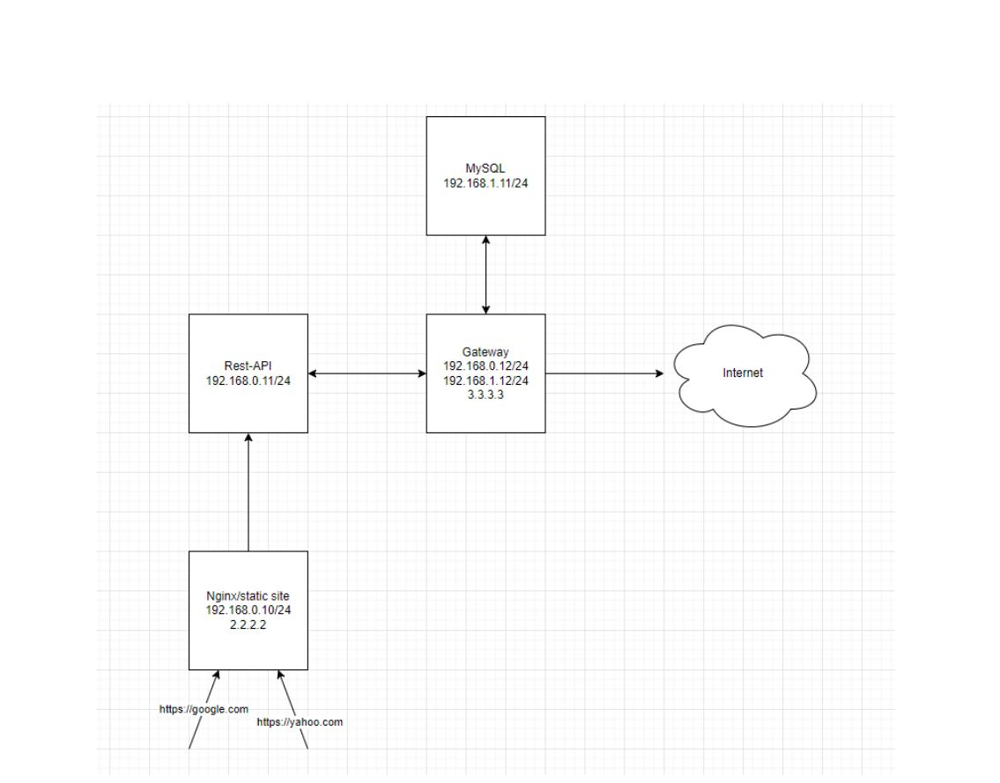

# Phone Book

In this project, we have used 4 servers Nginx, Rest Api, Gateway and Mysql.

You make your request through your laptop to address Nginx server at port 18080 . So Nginx reverse proxy your request to the Rest server.
We do this to keep our REST server in front of you hide :) 

(Proxy -> hide client and reverse proxy -> hide server)

Now your request goes to Server REST to perform the requested operation . To perform the operation we need a database located inside the MYSQL server . It should be noted that only servers NGINX and Gateway have valid IPs And servers REST and MYSQL only connect to the Internet via Gateway . As a result, Server REST must be connected to Server MYSQL via Gateway .

Note that we must have only one default gateway in each server .

The answer to your request is sent through server REST to server NGINX and as a result you can receive it .

## Concepts we learned in this project 

1. Work with Linux operating system

2. Basic concepts of networking

3. IPtables

4. Web Server

5. The concept of DMZ

6. Mysql

7. Http / Https

8. SSL / TLS handshake

9. Certificate

10. Symmetric and asymmetric cryptography 

